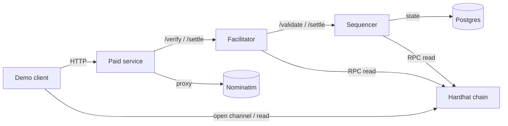
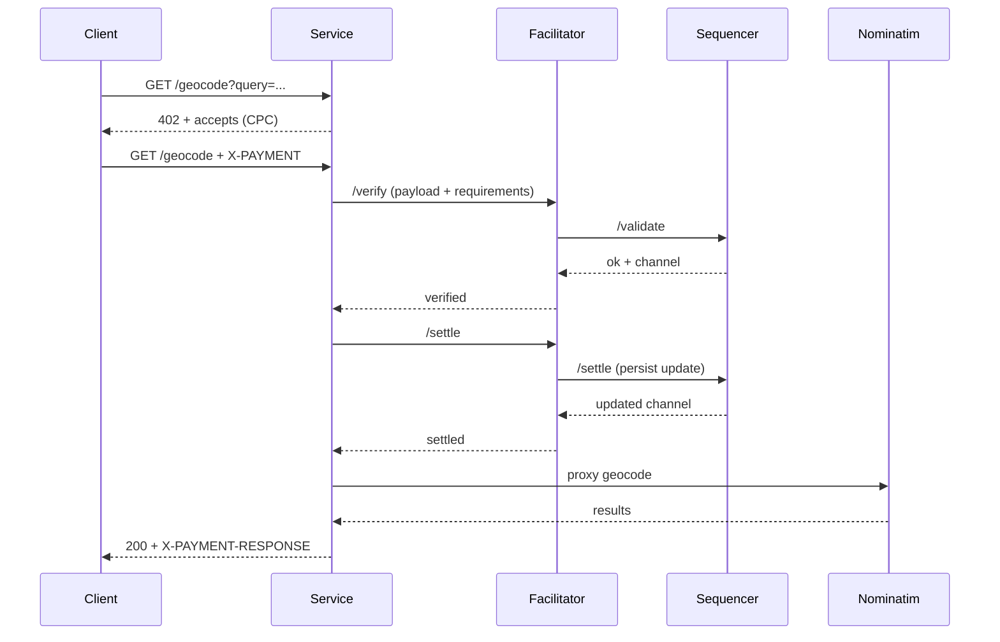

# x402 Hackathon Monorepo

CPC payment-channel demo using x402 v1. This repo is structured to be handed off as a self-contained monorepo.

## Layout

- `contracts/hardhat` - CPC contract plan + local chain scaffolding
- `apps/sequencer` - Sequencer service (off-chain channel updates)
- `facilitator/x402-rs` - x402-rs fork as a git submodule
- `apps/service` - Paid API demo (returns 402 + CPC scheme)
- `apps/demo-client` - One-off TSX client script
- `packages/cpc-x402-sdk` - Client helpers (signing + payload helpers)
- `docs` - Protocol notes, schema spec, hackathon checklist
- `infra` - Docker compose + env templates
- `scripts` - Seed/run/demo helpers

## Architecture



## Sequence (402 -> pay -> 200)



## Facilitator fork (submodule)

`facilitator/x402-rs` is a git submodule pointing to the fork:
- `origin`: git@github.com:apetersson/x402-rs.git
- `upstream`: https://github.com/x402-rs/x402-rs.git

Rebase workflow:

```bash
cd facilitator/x402-rs
git fetch upstream
git rebase upstream/main
```

Keep CPC changes isolated to a new scheme module and a small registration change so upstream PRs are clean.

## Quickstart

If you have not initialized submodules yet, do this once:

```bash
git submodule update --init --recursive
```

Run the full demo (bootstrap chain, start stack, run client):

```bash
./scripts/run-demo.sh
```

Notes:
- `./scripts/run-demo.sh` runs `infra/bootstrap-hardhat.sh`, starts the docker stack, waits for `/health`, then runs the client once.
- Re-run only the client with `./scripts/run-demo-client.sh`.
- To reuse an existing `.env` without redeploying: `SKIP_BOOTSTRAP=1 ./scripts/run-demo.sh`.
- Nominatim may take time to import data; set `SKIP_WAIT=1` to skip health checks if needed.

## Demo flow (target)

1. Start stack: hardhat + facilitator + sequencer + paid service
2. Run `apps/demo-client` TSX script
3. Observe 402 -> pay -> 200

## Current scheme

- Scheme ID: `v1-eip155-cpc`
- Spec: `docs/x402-eip155-cpc-schema.md`
